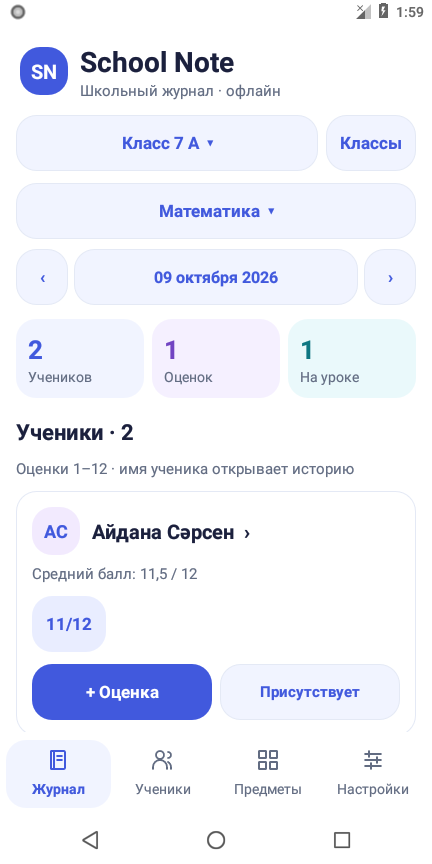

# School Note

Светлый школьный журнал для Android с крупными кнопками. Работает без интернета, поддерживает русский и казахский языки.

[Сайт и скачивание APK](https://fearkozha.github.io/School-Note/) · [APK 1.1.1](downloads/School-Note-1.1.1.apk) · [Инструкция](docs/Как-установить.md)

## Возможности

- Несколько классов, добавление и удаление учеников и предметов.
- Оценки с датой и комментарием, редактирование и история.
- Шкалы 5, 10, 12, 100 или свой максимум от 2 до 100.
- Посещаемость: присутствует, отсутствует, опоздал, уважительная причина.
- Переключение русского и казахского интерфейса.
- Постоянное хранение в SQLite и резервные копии JSON.

Android 8.0 и новее. Приложение не запрашивает сетевые разрешения и не отправляет данные учеников на сервер.

## Структура

- `android/` — исходники, ресурсы, сборка и инструментальные проверки.
- `website/` — статическая страница скачивания.
- `downloads/` — подписанный APK и его контрольная сумма.
- `docs/` — инструкция, отчёт проверки и снимки интерфейса.

## Сборка и проверки

Нужны Windows, Python 3, JDK 17+, Android SDK platform 35 и build-tools 35.0.0.
Задайте `JAVA_HOME` и `ANDROID_SDK_ROOT`, перейдите в `android` и выполните `python build.py`.
Подробности — в [описании сборки](android/README.md).

В версии 1.1.0 проверены установка на Android 8.0, 62 проверки функций и интерфейса,
а также 5 проверок сохранения данных после остановки и перезапуска приложения.
В версии 1.1.1 добавлено авторство; проверены сборка и подпись APK.
Полный отчёт — в [документации](docs/Проверка-School-Note.md).

Ключ подписи опубликованного APK не включён в репозиторий. Самостоятельная сборка
создаёт свой ключ и устанавливается как обновление только поверх APK с тем же ключом.

Сайт публикуется через GitHub Pages из ветки `gh-pages`. Исходные файлы находятся в `website/`.
APK и архив исходников скачиваются из GitHub Releases.

Сделано Айқожа Умар.
